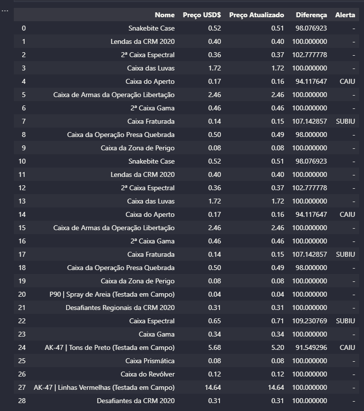
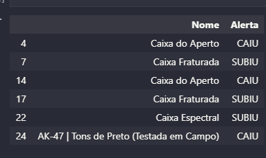
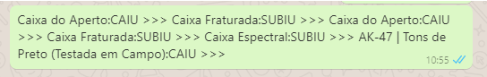

# Automação STEAM
Automação no monitoramento de preços do mercado de skins de CSGO.
## Extração dos dados
Com a utilização da ferramenta webdriver as informações são extraídas direto do site:
[CSGO Itens in to STEAM site](https://steamcommunity.com/market/search?appid=730) 
</img>
## Tratamento 

É feito um tratamento com essas informações para detecção de oportunidades

</img>

## Envio via Whatsapp 
Quando detectado uma oportunidade de mercado é enviado um alerta via whatsapp.
</img>
